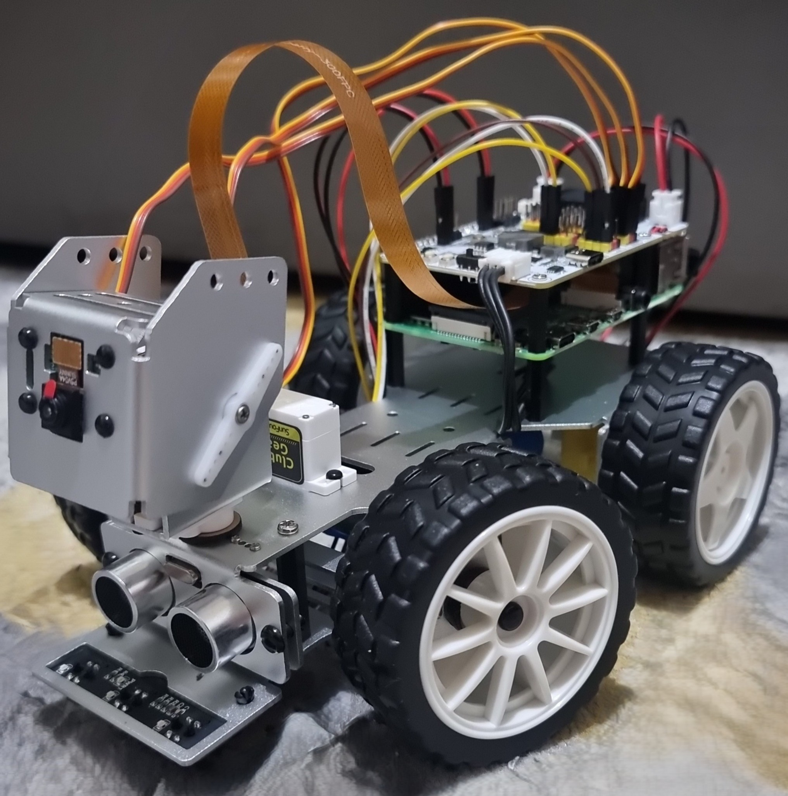

# 🚗 Wireless Surveillance Car


A smart, modular robotic vehicle built using the SunFounder PiCar-X platform and Raspberry Pi 4. The car supports both manual and autonomous modes, integrating real-time camera preview, obstacle detection, and basic traffic light recognition.



---

## 🧠 Features

- 🔧 Manual control via keyboard (with pan/tilt camera support)
- 🧭 Grayscale line following using a 3-channel sensor array
- 🚧 Obstacle avoidance with ultrasonic sensor
- 📷 Live camera preview using Vilib module
- 🚦 Experimental traffic light detection (red/green card recognition)
- 🧪 Modular Python architecture for easy testing and expansion

---

## 🧰 Technologies Used

- Python 3
- Raspberry Pi 4 (4GB)
- SunFounder PiCar-X Kit
- Vilib (for camera interface)
- Ultrasonic HC-SR04 Sensor
- Grayscale sensor array
- Servo motors (steering, pan, tilt)

---

## 📂 Project Structure

```plaintext
📂 Wireless-Surveillance-Car/
├── code/
│   ├── main.py
│   ├── motion.py
│   ├── keyboard_control.py
│   ├── Automatic_car.py
│   └── app_control.py
├── docs/
│   ├── car_photo.jpg
│   ├── line_following_demo.png
│   ├── motion_test.jpg
│   ├── keyboard_mode.jpg
│   └── autonomous_mode.jpg
├── README.md

---

## 🚦 Traffic Light Detection (Experimental)

The car can detect red or green cards using the PiCar-X camera and `Vilib.color_detect()`:
- 🟥 Red → stop
- 🟩 Green → continue

*Note: Works best with solid cards under good lighting conditions. Detection timeout is used to prevent stalling.*

---

## 🧪 How to Run

```bash
# Navigate to code directory
cd code

# Run the main menu interface
python3 main.py
Use your keyboard to:

Press 1 for motion demo

Press 2 for manual control

Press 3 for autonomous mode

Press 4 for mobile app control

Press q to quit
